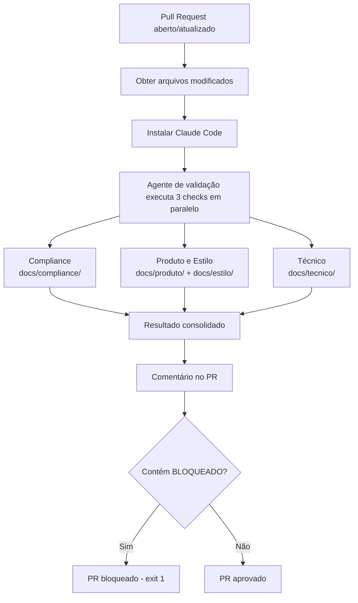

# Documentação — Sistema de Gestão

## Índice

- [Visão Geral](#visão-geral)
- [Estrutura](#estrutura)
- [CI/CD e Automações](#cicd-e-automações)

---

## Visão Geral

API REST em FastAPI para gestão de clientes, produtos e pedidos, com projeto DBT para transformação de dados.

## Estrutura

```
docs/
├── README.md          # Este arquivo
├── routes/            # Documentação dos endpoints REST
├── repositories/      # Documentação dos repositórios de dados
├── events/            # Documentação do event bus e handlers
├── middleware/        # Documentação dos middlewares
├── exceptions/        # Hierarquia de exceptions
└── tasks/             # Background tasks
```

## CI/CD e Automações

### 🆕 Novo — Validação Automática de Código (`code-validation.yml`)

Workflow do GitHub Actions executado em PRs que modificam `demo/src/**` ou `demo/dbt/**`.

**Gatilho:** Pull requests abertos ou atualizados com destino à branch `main`.

**Funcionamento:**



**Resultados possíveis:**

| Resultado | Descrição |
|-----------|-----------|
| `APROVADO` | Código alinhado com toda a documentação |
| `ATENCAO` | Possíveis conflitos — revisar antes de mergear |
| `BLOQUEADO` | Conflito direto com requisito documentado — PR bloqueado |

**Prompt de validação:** `validation-agent/prompts/validate-pr.md`

O agente lê os arquivos modificados e valida contra três categorias de documentação:
- **Compliance:** requisitos LGPD, políticas de dados, restrições de integração
- **Produto e Estilo:** decisões de produto, roadmap, regras de negócio, padrões de estilo
- **Técnico:** arquitetura, stack, princípios técnicos, padrões de testes
