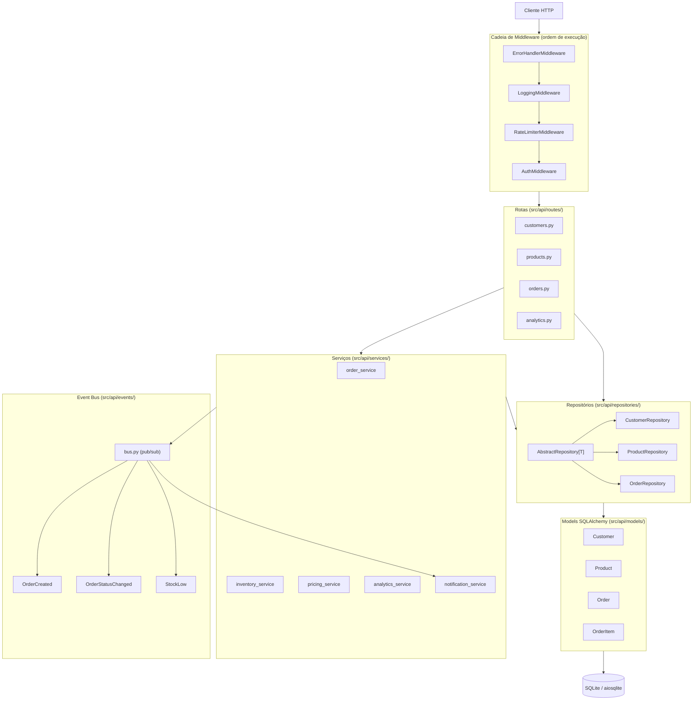

# Workshop Demo — Sistema de Gestão

API REST em FastAPI para gestão de clientes, produtos e pedidos. O sistema implementa um conjunto completo de padrões arquiteturais modernos, incluindo repository pattern, event bus in-process, cadeia de middleware e hierarquia de exceções customizadas.

---

## Diagrama de Arquitetura



---

## Stack Tecnológica

| Camada | Tecnologia |
|--------|-----------|
| Framework web | FastAPI 0.110+ |
| Servidor ASGI | Uvicorn |
| ORM | SQLAlchemy 2.0+ (async) |
| Banco de dados | SQLite + aiosqlite (dev) |
| Validação de dados | Pydantic 2.0+ |
| Migrações | Alembic 1.13+ |
| Transformação de dados | DBT Core + DuckDB |
| Testes | pytest 8.0+ + pytest-asyncio + httpx |
| Python | 3.11+ |

---

## Estrutura de Diretórios

```
demo/
├── src/api/
│   ├── main.py             # Ponto de entrada da aplicação
│   ├── config.py           # Configurações via variáveis de ambiente
│   ├── database.py         # Engine e sessão assíncrona
│   ├── models/             # Models SQLAlchemy
│   ├── schemas/            # Schemas Pydantic (request/response)
│   ├── repositories/       # Repository pattern (CRUD abstrato)
│   ├── routes/             # Endpoints FastAPI
│   ├── services/           # Lógica de negócio
│   ├── middleware/         # Cadeia de middleware HTTP
│   ├── events/             # Event bus in-process
│   ├── exceptions/         # Hierarquia de exceções customizadas
│   └── tasks/              # Background tasks
├── dbt/                    # Projeto DBT para transformação de dados
│   ├── models/
│   │   ├── staging/        # Camada stg_* (normalização da fonte)
│   │   ├── intermediate/   # Camada int_* (agregações)
│   │   └── marts/          # Camada dim_*/fct_* (consumo analítico)
│   └── macros/
├── migrations/             # Migrações Alembic
└── tests/                  # Testes com pytest + httpx
```

---

## Como Rodar Localmente

### Pré-requisitos

- Python 3.11+
- pip ou uv

### Instalação

```bash
# Instalar dependências
pip install -r requirements.txt

# Ou com uv
uv pip install -r requirements.txt
```

### Executar a API

```bash
# A partir do diretório demo/
uvicorn src.api.main:app --reload
```

A API estará disponível em `http://localhost:8000`.

- Documentação interativa (Swagger): `http://localhost:8000/docs`
- Documentação alternativa (ReDoc): `http://localhost:8000/redoc`

### Variáveis de Ambiente

Todas as variáveis usam o prefixo `DEMO_`:

| Variável | Padrão | Descrição |
|----------|--------|-----------|
| `DEMO_APP_NAME` | `Workshop Demo API` | Nome da aplicação |
| `DEMO_DATABASE_URL` | `sqlite+aiosqlite:///./demo.db` | URL do banco de dados |
| `DEMO_API_KEY` | `demo-api-key-2024` | Chave de API para autenticação |
| `DEMO_RATE_LIMIT_REQUESTS` | `100` | Máximo de requisições por janela |
| `DEMO_RATE_LIMIT_WINDOW_SECONDS` | `60` | Janela do rate limiter (segundos) |
| `DEMO_DEBUG` | `false` | Ativa logs SQL do SQLAlchemy |

### Autenticação

Todas as requisições (exceto `/health`, `/docs`, `/redoc`, `/openapi.json`) exigem o header:

```
X-API-Key: demo-api-key-2024
```

### Executar os Testes

```bash
pytest
```

### Executar o DBT

```bash
cd dbt/
dbt run
dbt test
```

---

## Padrões Arquiteturais

- **Repository Pattern**: `AbstractRepository[T]` fornece CRUD genérico; repositórios concretos adicionam métodos específicos de domínio.
- **Event Bus In-Process**: Publish/subscribe desacoplado; serviços publicam eventos sem conhecer os consumidores.
- **Middleware Chain**: Pilha LIFO — o último middleware adicionado é o mais externo. Ordem efetiva: `ErrorHandler → Logging → RateLimiter → Auth → Rota`.
- **Exceções com HTTP Status**: `AppException` carrega `status_code`; o `ErrorHandlerMiddleware` converte automaticamente para respostas JSON.
- **Schemas Pydantic separados dos Models**: Evita exposição acidental de campos internos e facilita evolução independente.
