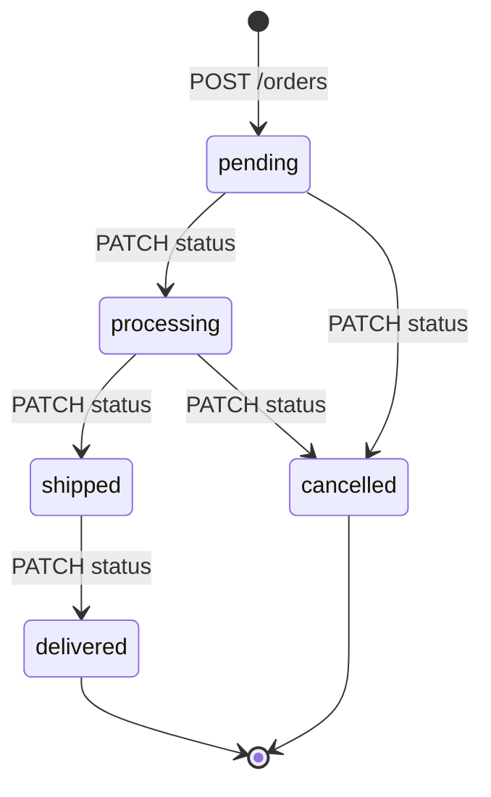

# API — Pedidos

Rotas para gestão de pedidos. Prefixo: `/api/v1/orders`.

---

## Endpoints

### `GET /api/v1/orders`

Lista pedidos com paginação e filtros opcionais.

**Query Parameters**

| Parâmetro | Tipo | Obrigatório | Padrão | Descrição |
|-----------|------|-------------|--------|-----------|
| `page` | `int` | Não | `1` | Página atual |
| `page_size` | `int` | Não | `20` | Itens por página |
| `status` | `string` | Não | — | Filtra por status |
| `customer_id` | `string` | Não | — | Filtra por cliente |

**Response `200 OK`**

```json
{
  "items": [
    {
      "id": "abc123",
      "customer_id": "cust456",
      "status": "pending",
      "total": 45000.0,
      "notes": "Entregar no período da manhã",
      "items": [
        {
          "id": "item789",
          "product_id": "prod001",
          "quantity": 2,
          "unit_price": 22500.0
        }
      ],
      "created_at": "2024-03-01T14:00:00",
      "updated_at": "2024-03-01T14:00:00"
    }
  ],
  "total": 30,
  "page": 1,
  "page_size": 20,
  "pages": 2
}
```

---

### `GET /api/v1/orders/{order_id}`

Retorna um pedido pelo ID, incluindo todos os itens.

**Path Parameters**

| Parâmetro | Tipo | Descrição |
|-----------|------|-----------|
| `order_id` | `string` | UUID do pedido |

**Response `200 OK`** — Mesmo schema do item acima.

**Códigos de Erro**

| Código | Motivo |
|--------|--------|
| `404` | Pedido não encontrado |

---

### `POST /api/v1/orders`

Cria um novo pedido.

**Comportamento interno:**
1. Valida que todos os produtos existem.
2. Reserva o estoque de cada produto (`inventory_service.reserve_stock`).
3. Calcula o total com descontos por volume (`pricing_service.calculate_order_total`).
4. Persiste o pedido e os itens no banco.
5. Publica o evento `OrderCreated` no event bus.

**Request Body**

```json
{
  "customer_id": "cust456",
  "notes": "Entregar no período da manhã",
  "items": [
    {
      "product_id": "prod001",
      "quantity": 2
    },
    {
      "product_id": "prod002",
      "quantity": 5
    }
  ]
}
```

| Campo | Tipo | Obrigatório | Descrição |
|-------|------|-------------|-----------|
| `customer_id` | `string` | Sim | UUID do cliente |
| `items` | `array` | Sim | Lista de itens (mín. 1) |
| `items[].product_id` | `string` | Sim | UUID do produto |
| `items[].quantity` | `int` | Sim | Quantidade desejada |
| `notes` | `string` | Não | Observações |

**Response `201 Created`** — Retorna o pedido criado com todos os itens.

**Códigos de Erro**

| Código | Motivo |
|--------|--------|
| `404` | Produto não encontrado |
| `409` | Estoque insuficiente para algum produto |

---

### `PATCH /api/v1/orders/{order_id}/status`

Atualiza o status de um pedido. Apenas transições válidas são permitidas.

**Path Parameters**

| Parâmetro | Tipo | Descrição |
|-----------|------|-----------|
| `order_id` | `string` | UUID do pedido |

**Request Body**

```json
{
  "status": "processing"
}
```

**Response `200 OK`** — Retorna o pedido com o novo status.

**Comportamento especial:** Ao transitar para `cancelled`, o estoque de todos os itens é devolvido automaticamente.

**Códigos de Erro**

| Código | Motivo |
|--------|--------|
| `404` | Pedido não encontrado |
| `422` | Transição de status inválida |

---

## Máquina de Estados — Status do Pedido



| Status | Transições permitidas |
|--------|----------------------|
| `pending` | `processing`, `cancelled` |
| `processing` | `shipped`, `cancelled` |
| `shipped` | `delivered` |
| `delivered` | — (estado final) |
| `cancelled` | — (estado final) |

> Ao cancelar um pedido com status `processing`, o estoque reservado é **devolvido** automaticamente.
