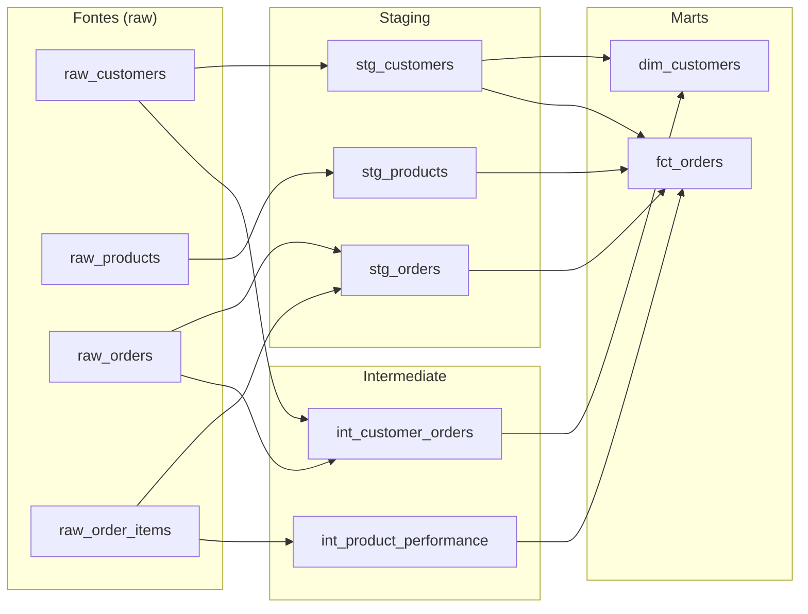

# Documentação DBT

Projeto DBT para transformação de dados analíticos do sistema de gestão. Utiliza DuckDB como adapter.

---

## Estrutura de Camadas

```
dbt/models/
├── staging/          # stg_* — normalização e limpeza da fonte
├── intermediate/     # int_* — agregações e enriquecimento
└── marts/            # dim_*/fct_* — modelos de consumo analítico
```

---

## Diagrama de Lineage



---

## Macros (`dbt/macros/`)

### `cents_to_reais(column_name)`

Converte valores em centavos para Reais.

```sql
{{ cents_to_reais('price') }}
-- resulta em: round(cast(price as float) / 100, 2)
```

---

## Modelos de Staging

### `stg_customers`

Normaliza dados de clientes da tabela `raw_customers`.

**Transformações:**
- `email` convertido para minúsculas
- `segment` mapeado para valores padronizados (bronze/silver/gold)
- Filtra registros com `is_active = true`

**Colunas:**

| Coluna | Tipo | Descrição |
|--------|------|-----------|
| `customer_id` | `string` | Identificador único do cliente |
| `name` | `string` | Nome do cliente |
| `email` | `string` | E-mail em minúsculas |
| `phone` | `string` | Telefone de contato |
| `segment` | `string` | Segmento normalizado |
| `created_at` | `timestamp` | Data de cadastro |

---

### `stg_products`

Normaliza dados de produtos da tabela `raw_products`.

**Transformações:**
- `sku` convertido para maiúsculas
- `category` convertida para minúsculas
- `price` convertido de centavos para Reais via macro `cents_to_reais`

**Colunas:**

| Coluna | Tipo | Descrição |
|--------|------|-----------|
| `product_id` | `string` | Identificador único do produto |
| `name` | `string` | Nome do produto |
| `sku` | `string` | SKU em maiúsculas |
| `category` | `string` | Categoria em minúsculas |
| `price_brl` | `float` | Preço em Reais |
| `stock` | `int` | Quantidade em estoque |

---

### `stg_orders`

Normaliza pedidos e itens das tabelas `raw_orders` e `raw_order_items`.

**Transformações:**
- Status convertido de códigos para texto descritivo
- `total` e `unit_price` convertidos de centavos para Reais via `cents_to_reais`
- Join com `raw_order_items` para denormalizar itens

**Colunas:**

| Coluna | Tipo | Descrição |
|--------|------|-----------|
| `order_id` | `string` | Identificador único do pedido |
| `customer_id` | `string` | Referência ao cliente |
| `status` | `string` | Status textual do pedido |
| `total_brl` | `float` | Total em Reais |
| `created_at` | `timestamp` | Data de criação |
| `item_id` | `string` | Identificador do item |
| `product_id` | `string` | Referência ao produto |
| `quantity` | `int` | Quantidade do item |
| `unit_price_brl` | `float` | Preço unitário em Reais |

---

## Modelos Intermediate

### `int_customer_orders`

Agrega métricas de pedidos por cliente.

**Fontes:** `raw_customers`, `raw_orders`

**Colunas:**

| Coluna | Tipo | Descrição |
|--------|------|-----------|
| `customer_id` | `string` | Identificador do cliente |
| `customer_name` | `string` | Nome do cliente |
| `email` | `string` | E-mail do cliente |
| `segment` | `string` | Segmento do cliente |
| `total_orders` | `int` | Total de pedidos (não cancelados) |
| `total_spent_brl` | `float` | Total gasto em Reais |
| `first_order_date` | `date` | Data do primeiro pedido |
| `last_order_date` | `date` | Data do último pedido |

---

### `int_product_performance`

Calcula métricas de desempenho por produto.

**Fontes:** `raw_order_items`

**Colunas:**

| Coluna | Tipo | Descrição |
|--------|------|-----------|
| `product_id` | `string` | Identificador do produto |
| `total_units_sold` | `int` | Total de unidades vendidas |
| `total_revenue_brl` | `float` | Receita total em Reais |
| `order_count` | `int` | Número de pedidos que incluem o produto |

---

## Modelos de Marts

### `dim_customers`

Dimensão de clientes com segmentação calculada.

**Fontes:** `stg_customers`, `int_customer_orders`

**Colunas:**

| Coluna | Tipo | Descrição |
|--------|------|-----------|
| `customer_id` | `string` | Chave primária |
| `name` | `string` | Nome completo |
| `email` | `string` | E-mail |
| `phone` | `string` | Telefone |
| `segment` | `string` | Segmento original |
| `calculated_segment` | `string` | Segmento calculado pelo gasto total |
| `total_orders` | `int` | Total de pedidos |
| `total_spent_brl` | `float` | Total gasto em Reais |
| `first_order_date` | `date` | Primeira compra |
| `last_order_date` | `date` | Última compra |

**Regra de segmentação calculada:**

| Gasto total | Segmento |
|------------|----------|
| ≥ R$ 10.000 | `gold` |
| ≥ R$ 5.000 | `silver` |
| < R$ 5.000 | `bronze` |

---

### `fct_orders`

Tabela fato de pedidos com enriquecimento de cliente e produto.

**Fontes:** `stg_orders`, `stg_customers`, `stg_products`, `int_product_performance`

**Colunas:**

| Coluna | Tipo | Descrição |
|--------|------|-----------|
| `order_id` | `string` | Chave primária |
| `customer_id` | `string` | Referência ao cliente |
| `customer_name` | `string` | Nome do cliente (desnormalizado) |
| `customer_segment` | `string` | Segmento do cliente |
| `product_id` | `string` | Referência ao produto |
| `product_name` | `string` | Nome do produto (desnormalizado) |
| `product_category` | `string` | Categoria do produto |
| `status` | `string` | Status do pedido |
| `quantity` | `int` | Quantidade do item |
| `unit_price_brl` | `float` | Preço unitário em Reais |
| `total_brl` | `float` | Total do pedido em Reais |
| `order_date` | `date` | Data do pedido |

---

## Testes de Schema Recomendados

```yaml
models:
  - name: stg_customers
    columns:
      - name: customer_id
        tests: [unique, not_null]
      - name: email
        tests: [unique, not_null]
      - name: segment
        tests:
          - accepted_values:
              values: [bronze, silver, gold]

  - name: stg_products
    columns:
      - name: product_id
        tests: [unique, not_null]
      - name: sku
        tests: [unique, not_null]
      - name: price_brl
        tests: [not_null]

  - name: stg_orders
    columns:
      - name: order_id
        tests: [not_null]
      - name: customer_id
        tests:
          - not_null
          - relationships:
              to: ref('stg_customers')
              field: customer_id
      - name: status
        tests:
          - accepted_values:
              values: [pending, processing, shipped, delivered, cancelled]

  - name: dim_customers
    columns:
      - name: customer_id
        tests: [unique, not_null]

  - name: fct_orders
    columns:
      - name: order_id
        tests: [not_null]
      - name: customer_id
        tests:
          - relationships:
              to: ref('dim_customers')
              field: customer_id
```
