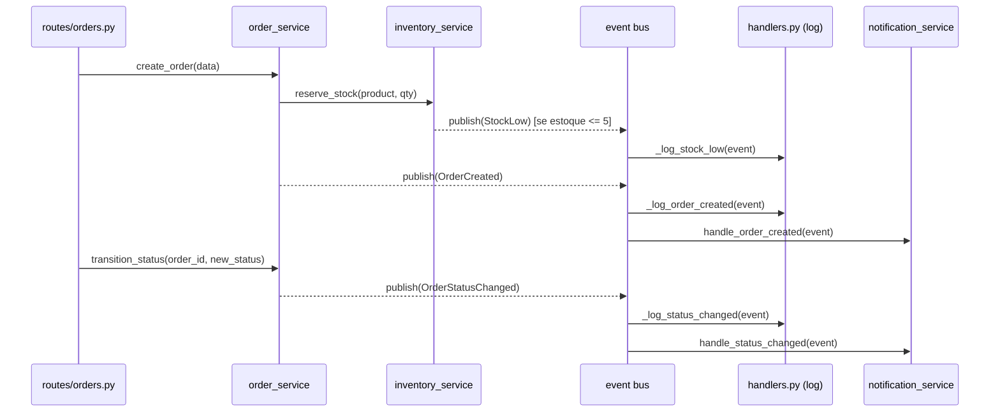

# Documentação do Sistema de Eventos

O sistema utiliza um **event bus in-process** baseado em publish/subscribe para comunicação desacoplada entre serviços. Implementado como um módulo simples em `src/api/events/`.

---

## Mecanismo de Publish/Subscribe

O bus é implementado como um dicionário global `_subscribers: dict[type, list[EventHandler]]` que associa tipos de evento a listas de handlers.

### `subscribe(event_type: type, handler: Callable) -> None`

Registra um handler para um tipo de evento. Múltiplos handlers podem ser registrados para o mesmo tipo.

### `publish(event: object) -> None`

Publica um evento para todos os handlers registrados. Cada handler é chamado de forma **síncrona e sequencial**. Erros em handlers individuais são capturados e logados sem interromper os demais handlers.

### `clear() -> None`

Remove todos os subscribers. Usado nos testes para isolar cada caso.

---

## Tipos de Eventos (`src/api/events/types.py`)

Todos os eventos são `dataclasses` imutáveis (`frozen=True`).

### `OrderCreated`

Publicado pelo `order_service` após a criação bem-sucedida de um pedido.

| Campo | Tipo | Descrição |
|-------|------|-----------|
| `order_id` | `str` | UUID do pedido criado |
| `customer_id` | `str` | UUID do cliente |
| `total` | `float` | Valor total do pedido (em centavos) |
| `item_count` | `int` | Número de itens no pedido |
| `timestamp` | `datetime` | Momento da publicação (default: `datetime.now()`) |

### `OrderStatusChanged`

Publicado pelo `order_service` após a transição de status de um pedido.

| Campo | Tipo | Descrição |
|-------|------|-----------|
| `order_id` | `str` | UUID do pedido |
| `old_status` | `str` | Status anterior |
| `new_status` | `str` | Novo status |
| `timestamp` | `datetime` | Momento da publicação |

### `StockLow`

Publicado pelo `inventory_service` quando o estoque de um produto atinge ou fica abaixo do limiar após uma reserva.

| Campo | Tipo | Padrão | Descrição |
|-------|------|--------|-----------|
| `product_id` | `str` | — | UUID do produto |
| `current_stock` | `int` | — | Estoque atual após a operação |
| `threshold` | `int` | `5` | Limiar que disparou o evento |
| `timestamp` | `datetime` | `datetime.now()` | Momento da publicação |

---

## Handlers e Subscribers

### Handlers de logging (`src/api/events/handlers.py`)

Registrados automaticamente na inicialização da aplicação via `setup_event_handlers()`.

| Evento | Handler | Ação |
|--------|---------|------|
| `OrderCreated` | `_log_order_created` | Loga pedido criado (id, cliente, total em R$) |
| `OrderStatusChanged` | `_log_status_changed` | Loga mudança de status |
| `StockLow` | `_log_stock_low` | Loga alerta de estoque baixo (nível WARNING) |

### Handlers de notificação (`src/api/services/notification_service.py`)

Registrados em `main.py` durante o lifespan da aplicação.

| Evento | Handler | Ação |
|--------|---------|------|
| `OrderCreated` | `handle_order_created` | Loga simulação de envio de confirmação ao cliente |
| `OrderStatusChanged` | `handle_status_changed` | Loga simulação de notificação de atualização de status |

> **Nota:** A implementação atual simula o envio de notificações via log. Uma integração real com e-mail/SMS exigiria substituir o corpo desses handlers.

---

## Fluxo de Eventos

