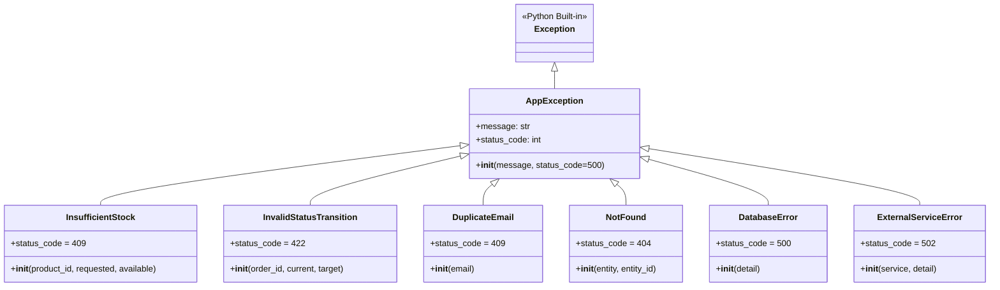

# Documentação da Hierarquia de Exceptions

O sistema define uma hierarquia customizada de exceções com código HTTP embutido, convertidas automaticamente para respostas JSON pelo `ErrorHandlerMiddleware`.

---

## Hierarquia de Classes



---

## AppException (`src/api/exceptions/base.py`)

Classe base de todas as exceções customizadas.

| Atributo | Tipo | Padrão | Descrição |
|----------|------|--------|-----------|
| `message` | `str` | — | Mensagem descritiva |
| `status_code` | `int` | `500` | Código HTTP da resposta |

O `ErrorHandlerMiddleware` intercepta qualquer `AppException` e retorna:
```json
HTTP {status_code}
{"detail": "{message}"}
```

---

## Exceções de Negócio (`src/api/exceptions/business.py`)

Representam violações de regras de domínio.

### `InsufficientStock`

Lançada quando a quantidade solicitada excede o estoque disponível.

| Parâmetro | Descrição |
|-----------|-----------|
| `product_id` | ID do produto |
| `requested` | Quantidade solicitada |
| `available` | Estoque disponível |

**HTTP:** `409 Conflict`

**Mensagem:** `"Estoque insuficiente para produto {id}: solicitado {n}, disponível {m}"`

**Onde é lançada:** `inventory_service.reserve_stock()`

---

### `InvalidStatusTransition`

Lançada quando se tenta uma transição de status não permitida na máquina de estados do pedido.

| Parâmetro | Descrição |
|-----------|-----------|
| `order_id` | ID do pedido |
| `current` | Status atual |
| `target` | Status destino inválido |

**HTTP:** `422 Unprocessable Entity`

**Mensagem:** `"Transição inválida para pedido {id}: {current} → {target}"`

**Onde é lançada:** `order_service.transition_status()`

---

### `DuplicateEmail`

Lançada ao tentar cadastrar um cliente com e-mail já existente.

| Parâmetro | Descrição |
|-----------|-----------|
| `email` | E-mail duplicado |

**HTTP:** `409 Conflict`

**Mensagem:** `"Email já cadastrado: {email}"`

**Onde é lançada:** `routes/customers.py → create_customer()`

---

### `NotFound`

Lançada quando uma entidade não é encontrada pelo ID.

| Parâmetro | Descrição |
|-----------|-----------|
| `entity` | Nome da entidade (ex: `"Cliente"`, `"Produto"`, `"Pedido"`) |
| `entity_id` | ID buscado |

**HTTP:** `404 Not Found`

**Mensagem:** `"{entity} não encontrado: {id}"`

**Onde é lançada:** Rotas de `customers`, `products`, `orders` e `order_service`.

---

## Exceções de Infraestrutura (`src/api/exceptions/infrastructure.py`)

Representam falhas técnicas externas ao domínio.

### `DatabaseError`

Erros genéricos de banco de dados.

**HTTP:** `500 Internal Server Error`

**Mensagem padrão:** `"Erro interno no banco de dados"`

> ⚠️ Necessita revisão humana: não há uso explícito desta exceção no código atual. Pode ser usada em futuras integrações ou camada de repositório.

---

### `ExternalServiceError`

Falhas em chamadas a serviços externos.

| Parâmetro | Descrição |
|-----------|-----------|
| `service` | Nome do serviço externo |
| `detail` | Detalhe do erro (opcional) |

**HTTP:** `502 Bad Gateway`

**Mensagem:** `"Erro no serviço externo '{service}': {detail}"`

> ⚠️ Necessita revisão humana: não há uso explícito desta exceção no código atual. Prevista para futuras integrações com APIs externas (pagamento, logística, etc.).
