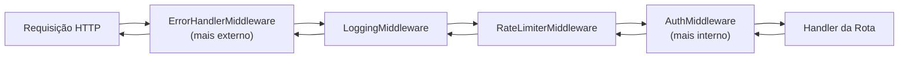

# Documentação da Cadeia de Middleware

A aplicação utiliza quatro middlewares baseados em `BaseHTTPMiddleware` do Starlette. A ordem de adição no FastAPI é invertida na execução (LIFO — Last In, First Out).

---

## Ordem de Execução



**Ordem de adição em `main.py` (inversa à execução):**
```python
app.add_middleware(ErrorHandlerMiddleware)   # 1º adicionado = mais externo
app.add_middleware(LoggingMiddleware)        # 2º
app.add_middleware(RateLimiterMiddleware)    # 3º
app.add_middleware(AuthMiddleware)           # 4º adicionado = mais interno
```

---

## ErrorHandlerMiddleware (`src/api/middleware/error_handler.py`)

**Posição:** Mais externo (envolve toda a pilha).

**Responsabilidade:** Capturar exceções e convertê-las em respostas JSON padronizadas.

### Comportamento

| Exceção capturada | Resposta |
|-------------------|----------|
| `AppException` (e subclasses) | `status_code` da exceção + `{"detail": e.message}` |
| Qualquer outra `Exception` | `500` + `{"detail": "Erro interno do servidor"}` + log de erro |

**Por que é o mais externo:** Precisa capturar exceções de qualquer camada, incluindo os outros middlewares.

---

## LoggingMiddleware (`src/api/middleware/logging.py`)

**Posição:** Segundo mais externo.

**Responsabilidade:** Registrar todas as requisições com método, path, status HTTP e tempo de resposta.

### Comportamento

Ao final de cada requisição, loga no nível `INFO`:

```
GET /api/v1/customers → 200 (45.3ms)
```

Usa `time.perf_counter()` para alta precisão no cálculo da duração.

---

## RateLimiterMiddleware (`src/api/middleware/rate_limiter.py`)

**Posição:** Terceiro.

**Responsabilidade:** Limitar o número de requisições por IP em uma janela de tempo deslizante.

### Configuração

| Parâmetro | Variável de Ambiente | Padrão |
|-----------|----------------------|--------|
| Máximo de requisições | `DEMO_RATE_LIMIT_REQUESTS` | `100` |
| Janela em segundos | `DEMO_RATE_LIMIT_WINDOW_SECONDS` | `60` |

### Comportamento

- Mantém um histórico de timestamps de requisições por IP em memória (`dict[str, list[float]]`).
- A cada requisição, remove timestamps mais antigos que a janela configurada.
- Se o número de timestamps restantes for ≥ ao limite, retorna `429`.
- O IP do cliente é extraído de `request.client.host`.

### Resposta de erro

```json
HTTP 429 Too Many Requests
{
  "detail": "Limite de requisições excedido. Tente novamente mais tarde."
}
```

> **Atenção:** O estado é armazenado **em memória da instância**. Em ambientes com múltiplos workers ou múltiplas instâncias, o limite não é compartilhado entre processos.

---

## AuthMiddleware (`src/api/middleware/auth.py`)

**Posição:** Mais interno (executado imediatamente antes da rota).

**Responsabilidade:** Validar a API Key em todas as requisições protegidas.

### Configuração

| Parâmetro | Variável de Ambiente | Padrão |
|-----------|----------------------|--------|
| API Key esperada | `DEMO_API_KEY` | `demo-api-key-2024` |

### Comportamento

- Verifica o header `X-API-Key` da requisição.
- Compara com o valor configurado em `settings.api_key`.

### Paths ignorados (sem autenticação)

| Path | Motivo |
|------|--------|
| `/docs` | Documentação Swagger UI |
| `/redoc` | Documentação ReDoc |
| `/openapi.json` | Schema OpenAPI |
| `/health` | Health check para load balancers |

### Resposta de erro

```json
HTTP 401 Unauthorized
{
  "detail": "API key inválida ou ausente"
}
```
