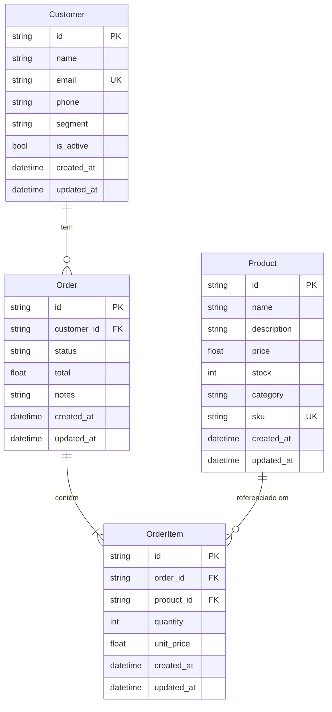

# Documentação de Models

Models SQLAlchemy que mapeiam as entidades do domínio para tabelas no banco de dados.

---

## Diagrama ER



---

## BaseModel (`src/api/models/base.py`)

Classe abstrata base da qual todos os models herdam.

| Campo | Tipo SQLAlchemy | Descrição |
|-------|----------------|-----------|
| `id` | `String` (PK) | UUID v4 gerado automaticamente |
| `created_at` | `DateTime` | Data/hora de criação (server default) |
| `updated_at` | `DateTime` | Data/hora da última atualização (onupdate) |

---

## Customer (`src/api/models/customer.py`)

Representa um cliente do sistema.

**Tabela:** `customers`

| Campo | Tipo SQLAlchemy | Restrições | Descrição |
|-------|----------------|------------|-----------|
| `name` | `String(255)` | NOT NULL | Nome completo |
| `email` | `String(255)` | NOT NULL, UNIQUE, INDEX | Endereço de e-mail |
| `phone` | `String(50)` | nullable | Telefone de contato |
| `segment` | `String(50)` | NOT NULL, default `"bronze"` | Segmento do cliente |
| `is_active` | `Boolean` | NOT NULL, default `True` | Indica se o cliente está ativo |

**Relacionamentos**

| Atributo | Tipo | Direção | Descrição |
|----------|------|---------|-----------|
| `orders` | `list[Order]` | 1:N | Pedidos realizados pelo cliente |

**Valores esperados para `segment`:** `bronze`, `silver`, `gold` (convenção; não há constraint no banco).

---

## Product (`src/api/models/product.py`)

Representa um produto disponível para venda.

**Tabela:** `products`

| Campo | Tipo SQLAlchemy | Restrições | Descrição |
|-------|----------------|------------|-----------|
| `name` | `String(255)` | NOT NULL | Nome do produto |
| `description` | `Text` | nullable | Descrição detalhada |
| `price` | `Float` | NOT NULL | Preço em centavos |
| `stock` | `Integer` | NOT NULL, default `0` | Quantidade disponível em estoque |
| `category` | `String(100)` | NOT NULL, INDEX | Categoria do produto |
| `sku` | `String(50)` | NOT NULL, UNIQUE | Código SKU único |

> **Atenção:** O campo `price` é armazenado em centavos (ex: `45000` = R$ 450,00). A conversão para exibição é feita pelo macro DBT `cents_to_reais`.

---

## Order (`src/api/models/order.py`)

Representa um pedido de compra.

**Tabela:** `orders`

| Campo | Tipo SQLAlchemy | Restrições | Descrição |
|-------|----------------|------------|-----------|
| `customer_id` | `String` (FK) | NOT NULL | Referência ao cliente |
| `status` | `String(50)` | NOT NULL, default `"pending"` | Status atual do pedido |
| `total` | `Float` | NOT NULL, default `0.0` | Valor total em centavos |
| `notes` | `Text` | nullable | Observações do pedido |

**Relacionamentos**

| Atributo | Tipo | Direção | Descrição |
|----------|------|---------|-----------|
| `customer` | `Customer` | N:1 | Cliente dono do pedido |
| `items` | `list[OrderItem]` | 1:N | Itens do pedido (cascade delete) |

**Método de negócio:**

```python
def can_transition_to(self, new_status: str) -> bool
```

Verifica se a transição de status é permitida pela máquina de estados. Ver [docs/api/orders.md](../api/orders.md) para o diagrama de estados completo.

**Transições válidas:**

| Status atual | Para |
|-------------|------|
| `pending` | `processing`, `cancelled` |
| `processing` | `shipped`, `cancelled` |
| `shipped` | `delivered` |
| `delivered` | — |
| `cancelled` | — |

---

## OrderItem (`src/api/models/order_item.py`)

Representa um item dentro de um pedido.

**Tabela:** `order_items`

| Campo | Tipo SQLAlchemy | Restrições | Descrição |
|-------|----------------|------------|-----------|
| `order_id` | `String` (FK) | NOT NULL | Referência ao pedido |
| `product_id` | `String` (FK) | NOT NULL | Referência ao produto |
| `quantity` | `Integer` | NOT NULL | Quantidade do produto |
| `unit_price` | `Float` | NOT NULL | Preço unitário no momento da compra |

**Relacionamentos**

| Atributo | Tipo | Direção | Descrição |
|----------|------|---------|-----------|
| `order` | `Order` | N:1 | Pedido ao qual pertence |
| `product` | `Product` | N:1 | Produto referenciado |

> **Nota:** `unit_price` registra o preço no momento da criação do pedido, preservando histórico mesmo que o preço do produto mude posteriormente.
