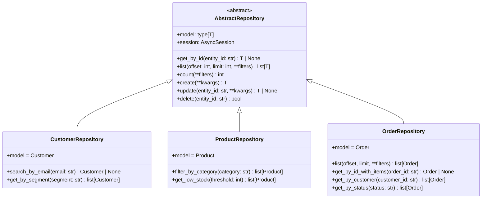

# Documentação de Repositórios

O sistema utiliza o **Repository Pattern** para abstrair o acesso ao banco de dados. Todos os repositórios herdam de `AbstractRepository[T]`, que fornece operações CRUD genéricas via SQLAlchemy assíncrono.

---

## Diagrama de Herança

---

## AbstractRepository (`src/api/repositories/base.py`)

Classe base genérica que implementa CRUD para qualquer model SQLAlchemy.

**Instanciação:** Cada repositório concreto recebe uma `AsyncSession` via injeção de dependência do FastAPI.

### Métodos

#### `get_by_id(entity_id: str) -> T | None`

Busca uma entidade pelo ID primário.

| Parâmetro | Tipo | Descrição |
|-----------|------|-----------|
| `entity_id` | `str` | UUID da entidade |

**Retorno:** A entidade encontrada ou `None`.

---

#### `list(offset: int = 0, limit: int = 20, **filters) -> list[T]`

Lista entidades com suporte a paginação e filtros de igualdade dinâmicos.

| Parâmetro | Tipo | Padrão | Descrição |
|-----------|------|--------|-----------|
| `offset` | `int` | `0` | Número de registros a pular |
| `limit` | `int` | `20` | Máximo de registros retornados |
| `**filters` | `Any` | — | Filtros de igualdade por nome de campo |

Filtros com valor `None` são ignorados. Campos inexistentes no model também são ignorados.

---

#### `count(**filters) -> int`

Retorna o total de registros que satisfazem os filtros.

Mesma lógica de filtros do método `list`.

---

#### `create(**kwargs) -> T`

Cria e persiste uma nova entidade. Usa `session.flush()` para obter o ID gerado sem commitar.

---

#### `update(entity_id: str, **kwargs) -> T | None`

Atualiza campos de uma entidade existente. Campos com valor `None` são ignorados.

**Retorno:** Entidade atualizada ou `None` se não encontrada.

---

#### `delete(entity_id: str) -> bool`

Remove uma entidade pelo ID.

**Retorno:** `True` se deletada com sucesso, `False` se não encontrada.

---

## CustomerRepository (`src/api/repositories/customer_repository.py`)

Repositório especializado para a entidade `Customer`.

### Métodos Adicionais

#### `search_by_email(email: str) -> Customer | None`

Busca um cliente pelo endereço de e-mail (correspondência exata).

#### `get_by_segment(segment: str) -> list[Customer]`

Retorna todos os clientes de um segmento específico (ex: `"gold"`, `"silver"`, `"bronze"`). Sem paginação.

---

## ProductRepository (`src/api/repositories/product_repository.py`)

Repositório especializado para a entidade `Product`.

### Métodos Adicionais

#### `filter_by_category(category: str) -> list[Product]`

Retorna todos os produtos de uma categoria. Sem paginação.

#### `get_low_stock(threshold: int = 5) -> list[Product]`

Retorna produtos com estoque menor ou igual ao `threshold`. O valor padrão é `5`.

---

## OrderRepository (`src/api/repositories/order_repository.py`)

Repositório especializado para a entidade `Order`. Sobrescreve o método `list` para incluir eager loading dos itens.

### Métodos Adicionais

#### `list(offset, limit, **filters) -> list[Order]` *(sobrescrito)*

Mesmo comportamento da classe base, porém **sempre carrega os itens do pedido** via `selectinload(Order.items)` para evitar queries N+1.

#### `get_by_id_with_items(order_id: str) -> Order | None`

Busca um pedido pelo ID com eager loading dos itens. Usado nos endpoints de criação e atualização de status para garantir que os itens estejam disponíveis na serialização da resposta.

#### `get_by_customer(customer_id: str) -> list[Order]`

Retorna todos os pedidos de um cliente. Sem eager loading dos itens e sem paginação.

#### `get_by_status(status: str) -> list[Order]`

Retorna todos os pedidos com um status específico. Sem eager loading dos itens e sem paginação.
