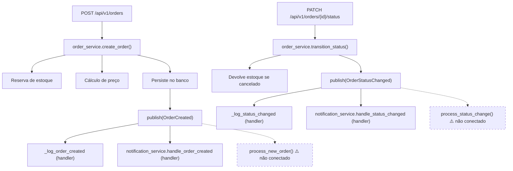

# Documentação de Background Tasks

O sistema possui dois módulos de background tasks em `src/api/tasks/`. As tarefas são síncronas e executadas como funções simples (não são tarefas assíncronas do FastAPI nem filas de mensagens).

> ⚠️ Necessita revisão humana: as tarefas estão implementadas como funções de log. Não há integração direta com o event bus nem chamadas a estas funções nas rotas ou serviços atualmente. Provavelmente representam um ponto de extensão para integrações futuras.

---

## `process_new_order` (`src/api/tasks/background.py`)

Simula o processamento de um novo pedido após sua criação.

**Assinatura:**
```python
def process_new_order(order_id: str) -> None
```

**Parâmetros:**

| Parâmetro | Tipo | Descrição |
|-----------|------|-----------|
| `order_id` | `str` | UUID do pedido a processar |

**Etapas simuladas (via log):**
1. Inicia o processamento do pedido
2. Envia confirmação para o pedido
3. Atualiza analytics para o pedido

**Quando deveria ser disparado:** Após a criação bem-sucedida de um pedido (`POST /api/v1/orders`). Atualmente o disparo é feito via event bus pelo `notification_service`, mas esta função poderia ser registrada como handler do evento `OrderCreated`.

---

## `process_status_change` (`src/api/tasks/order_processing.py`)

Simula o processamento assíncrono de uma mudança de status de pedido.

**Assinatura:**
```python
def process_status_change(order_id: str, old_status: str, new_status: str) -> None
```

**Parâmetros:**

| Parâmetro | Tipo | Descrição |
|-----------|------|-----------|
| `order_id` | `str` | UUID do pedido |
| `old_status` | `str` | Status anterior |
| `new_status` | `str` | Novo status |

**Ação:** Loga a mudança de status no nível `INFO`.

**Quando deveria ser disparado:** Após a transição de status de um pedido (`PATCH /api/v1/orders/{id}/status`). Poderia ser registrado como handler do evento `OrderStatusChanged`.

---

## Fluxo Esperado de Processamento Pós-Pedido


